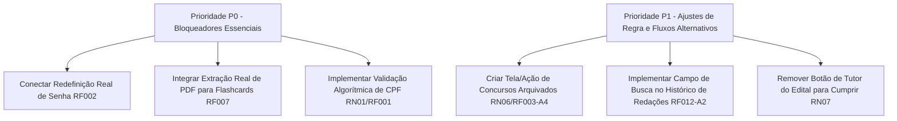

# Relatório de Auditoria Técnica de Software: Matriz de Conformidade

**Projeto:** RememberFlash  
**Data da Auditoria:** 10 de Setembro de 2026  
**Auditor Responsável:** Auditoria Técnica de Software  
**Documentos de Referência:**
- [docs/requisitos.md](file:///c:/Users/User/Documents/teste%20de%20autma%C3%A7%C3%A3o/RememberFlash/docs/requisitos.md) (Requisitos Funcionais RF001 a RF014)
- [docs/01_regras_de_negocio.md](file:///c:/Users/User/Documents/teste%20de%20autma%C3%A7%C3%A3o/RememberFlash/docs/01_regras_de_negocio.md) (Regras de Negócio RN01 a RN08)
- Código-fonte Android/Kotlin em [app/src/main/java](file:///c:/Users/User/Documents/teste%20de%20autma%C3%A7%C3%A3o/RememberFlash/app/src/main/java)

---

## Sumário Executivo

Esta auditoria realizou uma verificação estrita de conformidade entre os requisitos funcionais, regras de negócio documentadas e o código-fonte implementado no aplicativo Android **RememberFlash**. 

O objetivo foi avaliar:
1. Requisitos funcionais 100% aderentes;
2. Requisitos com implementação parcial, falhas de contrato ou regras pendentes;
3. Código implementado que excede o escopo documentado;
4. Plano de ação estritamente prioritário para fechamento do escopo essencial.

---

## 1. Requisitos Funcionais 100% Atendidos

Os seguintes requisitos possuem telas, ViewModels, UseCases, persistência local (Room/Preferences) e integração com a API do Google Gemini em total conformidade com a especificação:

| Requisito | Nome | Prioridade | Evidências no Código-Fonte |
| :--- | :--- | :--- | :--- |
| **RF004** | **Manter Disciplina** | Essencial | [[DisciplineDao.kt]](file:///c:/Users/User/Documents/teste%20de%20autma%C3%A7%C3%A3o/RememberFlash/app/src/main/java/com/rememberflash/app/data/local/database/dao/DisciplineDao.kt), [[ContestDetailViewModel.kt]](file:///c:/Users/User/Documents/teste%20de%20autma%C3%A7%C3%A3o/RememberFlash/app/src/main/java/com/rememberflash/app/presentation/contest/detail/ContestDetailViewModel.kt), [[ContestDetailScreen.kt]](file:///c:/Users/User/Documents/teste%20de%20autma%C3%A7%C3%A3o/RememberFlash/app/src/main/java/com/rememberflash/app/presentation/contest/detail/ContestDetailScreen.kt). CRUD completo, exclusão em cascata preservando o concurso pai, validações de duplicidade de nome no mesmo concurso e bloqueio de nomes vazios. |
| **RF005** | **Parametrizar IAG** | Importante | [[SettingsScreen.kt]](file:///c:/Users/User/Documents/teste%20de%20autma%C3%A7%C3%A3o/RememberFlash/app/src/main/java/com/rememberflash/app/presentation/settings/SettingsScreen.kt), [[AiSettingsPreferences.kt]](file:///c:/Users/User/Documents/teste%20de%20autma%C3%A7%C3%A3o/RememberFlash/app/src/main/java/com/rememberflash/app/data/local/preferences/AiSettingsPreferences.kt), [[GeminiClient.kt]](file:///c:/Users/User/Documents/teste%20de%20autma%C3%A7%C3%A3o/RememberFlash/app/src/main/java/com/rememberflash/app/data/remote/gemini/GeminiClient.kt). Parametrização de dificuldade (Fácil, Médio, Difícil), rigor de redação (Flexível, Padrão, Rígido), tom do tutor (Direto, Explicativo) e chave de API pessoal (BYOK - RN08), sem permissão de prompts livres (RN04). |
| **RF006** | **Manter Flashcard** | Importante | [[FlashcardDeckScreen.kt]](file:///c:/Users/User/Documents/teste%20de%20autma%C3%A7%C3%A3o/RememberFlash/app/src/main/java/com/rememberflash/app/presentation/flashcard/FlashcardDeckScreen.kt), [[FlashcardDao.kt]](file:///c:/Users/User/Documents/teste%20de%20autma%C3%A7%C3%A3o/RememberFlash/app/src/main/java/com/rememberflash/app/data/local/database/dao/FlashcardDao.kt), [[CreateFlashcardUseCase.kt]](file:///c:/Users/User/Documents/teste%20de%20autma%C3%A7%C3%A3o/RememberFlash/app/src/main/java/com/rememberflash/app/domain/usecase/flashcard/CreateFlashcardUseCase.kt). Criação manual, edição e remoção de flashcards, validação obrigatória de frente e verso, persistência em Room. |
| **RF008** | **Manter Questões via IAG** | Essencial | [[GenerateQuestionsUseCase.kt]](file:///c:/Users/User/Documents/teste%20de%20autma%C3%A7%C3%A3o/RememberFlash/app/src/main/java/com/rememberflash/app/domain/usecase/question/GenerateQuestionsUseCase.kt), [[QuestionResolveScreen.kt]](file:///c:/Users/User/Documents/teste%20de%20autma%C3%A7%C3%A3o/RememberFlash/app/src/main/java/com/rememberflash/app/presentation/question/resolve/QuestionResolveScreen.kt). Injeção da banca, dificuldade e formato, validação de contrato JSON com fallback de erro (A1), bloqueio de segurança (A2) e redirecionamento direto para o ambiente de resolução. |
| **RF010** | **Visualizar Desempenho e Progresso** | Essencial | [[PerformanceTabContent.kt]](file:///c:/Users/User/Documents/teste%20de%20autma%C3%A7%C3%A3o/RememberFlash/app/src/main/java/com/rememberflash/app/presentation/home/components/PerformanceTabContent.kt), [[PerformanceFiltering.kt]](file:///c:/Users/User/Documents/teste%20de%20autma%C3%A7%C3%A3o/RememberFlash/app/src/main/java/com/rememberflash/app/presentation/home/util/PerformanceFiltering.kt). Métricas de volume total de questões resolvidas, taxa de acertos e erros (% e absolutos), quebra por matéria e simulado, filtros de tempo (7d, 30d, Visão Geral), filtro por disciplina, estado vazio e aviso de dados em cache offline. |
| **RF011** | **Avaliar Redação via OCR** | Essencial | [[EssayCaptureScreen.kt]](file:///c:/Users/User/Documents/teste%20de%20autma%C3%A7%C3%A3o/RememberFlash/app/src/main/java/com/rememberflash/app/presentation/essay/capture/EssayCaptureScreen.kt), [[MlKitTextExtractor.kt]](file:///c:/Users/User/Documents/teste%20de%20autma%C3%A7%C3%A3o/RememberFlash/app/src/main/java/com/rememberflash/app/data/ocr/MlKitTextExtractor.kt), [[EvaluateEssayUseCase.kt]](file:///c:/Users/User/Documents/teste%20de%20autma%C3%A7%C3%A3o/RememberFlash/app/src/main/java/com/rememberflash/app/domain/usecase/essay/EvaluateEssayUseCase.kt). Entrada digitada ou fotográfica via câmera/galeria com OCR, diálogo de corte, revisão humana, validação de tamanho mínimo de texto (>150 chars - A3) e correção da IA com nota e competências formativas. |
| **RF013** | **Manter Cronograma Dinâmico** | Essencial | [[ScheduleViewModel.kt]](file:///c:/Users/User/Documents/teste%20de%20autma%C3%A7%C3%A3o/RememberFlash/app/src/main/java/com/rememberflash/app/presentation/schedule/ScheduleViewModel.kt), [[GenerateStudyScheduleUseCase.kt]](file:///c:/Users/User/Documents/teste%20de%20autma%C3%A7%C3%A3o/RememberFlash/app/src/main/java/com/rememberflash/app/domain/usecase/schedule/GenerateStudyScheduleUseCase.kt), [[ScheduleTabContent.kt]](file:///c:/Users/User/Documents/teste%20de%20autma%C3%A7%C3%A3o/RememberFlash/app/src/main/java/com/rememberflash/app/presentation/home/components/ScheduleTabContent.kt). Parametrização por pasta de concurso, data da prova, tempo diário, matérias/dia e dias disponíveis. Bloqueio estrito de datas passadas (**RN05** e A1), renderização em calendário interativo com metas distribuídas e opção de recálculo (A2). |

---

## 2. Requisitos Parcialmente Implementados ou com Regras Pendentes

| Requisito / Regra | Grau de Conformidade | Lacuna / Regra Pendente Identificada |
| :--- | :--- | :--- |
| **RF001 - Manter Usuário** & **RN01** | **Parcial** | Em [[RegisterUseCase.kt#L28-L31]](file:///c:/Users/User/Documents/teste%20de%20autma%C3%A7%C3%A3o/RememberFlash/app/src/main/java/com/rememberflash/app/domain/usecase/auth/RegisterUseCase.kt#L28-L31), a validação de CPF único contém uma simulação com `startsWith("999")` e apenas validação de tamanho de 11 dígitos, **sem validação matemática dos 2 dígitos verificadores oficiais de CPF**. Além disso, o token de sessão retornado em [[LoginUseCase.kt#L23]](file:///c:/Users/User/Documents/teste%20de%20autma%C3%A7%C3%A3o/RememberFlash/app/src/main/java/com/rememberflash/app/domain/usecase/auth/LoginUseCase.kt#L23) é mockado (`"mock_token_login"`). |
| **RF002 - Alterar Senha** | **Crítico / Mockado** | As telas [[ForgotPasswordScreen.kt#L96]](file:///c:/Users/User/Documents/teste%20de%20autma%C3%A7%C3%A3o/RememberFlash/app/src/main/java/com/rememberflash/app/presentation/auth/ForgotPasswordScreen.kt#L96) e [[ResetPasswordScreen.kt#L172]](file:///c:/Users/User/Documents/teste%20de%20autma%C3%A7%C3%A3o/RememberFlash/app/src/main/java/com/rememberflash/app/presentation/auth/ResetPasswordScreen.kt#L172) possuem apenas simulação visual: `// Simula o envio de código` e `// Simula sucesso e volta para o login`. **Não há envio real de e-mail, geração/persistência de código OTP de 6 dígitos com expiração de 15 minutos**, e a senha **não é alterada no repositório de dados**. |
| **RF003 - Manter Concurso** & **RN06** | **Parcial** | O arquivamento lógico está persistido via `is_active = 0` no Room em [[ContestDao.kt#L22]](file:///c:/Users/User/Documents/teste%20de%20autma%C3%A7%C3%A3o/RememberFlash/app/src/main/java/com/rememberflash/app/data/local/database/dao/ContestDao.kt#L22). Contudo, o fluxo alternativo **A4 (Reativação de Concurso Arquivado)** e a determinação da **RN06** (permitir ao estudante listar pastas inativas e reativá-las) **não foram implementados na camada de apresentação (UI)**. |
| **RF007 - Flashcards via PDF** | **Parcial / Fake Data** | Em [[DisciplineViewModel.kt#L222-L226]](file:///c:/Users/User/Documents/teste%20de%20autma%C3%A7%C3%A3o/RememberFlash/app/src/main/java/com/rememberflash/app/presentation/discipline/DisciplineViewModel.kt#L222-L226), a extração do PDF **foi simulada**: o código gera uma string fixa a partir do nome do arquivo (`studyText = "Resumo analítico sobre a disciplina..."`) em vez de chamar [[LocalPdfExtractor.extractText]](file:///c:/Users/User/Documents/teste%20de%20autma%C3%A7%C3%A3o/RememberFlash/app/src/main/java/com/rememberflash/app/data/local/pdf/LocalPdfExtractor.kt). O fluxo alternativo **A2** (PDF sem texto) apenas checa se o nome do arquivo contém `"scanned"`. |
| **RF009 - Prova via Edital (PDF)** | **Parcial** | A resolução do simulado do concurso está pronta em [[QuestionResolveContestScreen.kt]](file:///c:/Users/User/Documents/teste%20de%20autma%C3%A7%C3%A3o/RememberFlash/app/src/main/java/com/rememberflash/app/presentation/question/resolve/QuestionResolveContestScreen.kt). No entanto, o UseCase [[GenerateContestMockExamUseCase.kt#L19]](file:///c:/Users/User/Documents/teste%20de%20autma%C3%A7%C3%A3o/RememberFlash/app/src/main/java/com/rememberflash/app/domain/usecase/question/GenerateContestMockExamUseCase.kt#L19) **não analisa o PDF do edital para extrair o Conteúdo Programático e os pesos**. Ele requer que as matérias já existam no banco, iterando sequencialmente sobre elas. |
| **RF012 - Histórico de Redações** | **Parcial** | A listagem cronológica, os cards informativos e a visualização detalhada de notas e competências funcionam. Porém, o fluxo alternativo **A2 (Busca e filtro em tempo real por palavra-chave no tema)** não foi desenvolvido em [[EssaysTabContent.kt]](file:///c:/Users/User/Documents/teste%20de%20autma%C3%A7%C3%A3o/RememberFlash/app/src/main/java/com/rememberflash/app/presentation/home/components/EssaysTabContent.kt). |
| **RF014 - Tutoria Interativa** & **RN07** | **Desvio de Escopo** | O chat 1:1 contextualizado e stateless funciona para dúvidas de Questões e Redações. Porém, foi incluída uma ramificação `"edital"` em [[TutorChatViewModel.kt#L94]](file:///c:/Users/User/Documents/teste%20de%20autma%C3%A7%C3%A3o/RememberFlash/app/src/main/java/com/rememberflash/app/presentation/tutor/TutorChatViewModel.kt#L94), acessível pela tela do concurso. Essa funcionalidade **fere diretamente a RN07**, que proíbe o acionamento da tutoria fora de questões respondidas ou redações corrigidas. |

---

## 3. Código Desenvolvido Fora do Escopo Documentado

Foram detectados artefatos e fluxos de software implementados na base de código que não estão documentados no escopo original:

1. **Camada Intermediária de "Tópicos" (Topic):**
   - **Artefatos:** [[TopicEntity.kt]](file:///c:/Users/User/Documents/teste%20de%20autma%C3%A7%C3%A3o/RememberFlash/app/src/main/java/com/rememberflash/app/data/local/database/entity/TopicEntity.kt), [[TopicDao.kt]](file:///c:/Users/User/Documents/teste%20de%20autma%C3%A7%C3%A3o/RememberFlash/app/src/main/java/com/rememberflash/app/data/local/database/dao/TopicDao.kt), [[TopicRepositoryImpl.kt]](file:///c:/Users/User/Documents/teste%20de%20autma%C3%A7%C3%A3o/RememberFlash/app/src/main/java/com/rememberflash/app/data/repository/TopicRepositoryImpl.kt), [[TopicFolderScreen.kt]](file:///c:/Users/User/Documents/teste%20de%20autma%C3%A7%C3%A3o/RememberFlash/app/src/main/java/com/rememberflash/app/presentation/topic/TopicFolderScreen.kt), [[TopicFolderViewModel.kt]](file:///c:/Users/User/Documents/teste%20de%20autma%C3%A7%C3%A3o/RememberFlash/app/src/main/java/com/rememberflash/app/presentation/topic/TopicFolderViewModel.kt) e 5 UseCases correlatos.
   - **Diagnóstico:** O escopo define a hierarquia `Concurso (Pasta)` $\rightarrow$ `Disciplina (Subcategoria)` $\rightarrow$ `Flashcards / Questões`. A adição de pastas de tópicos com acompanhamento de conclusão adicionou complexidade desnecessária e duplicou formulários de geração de IA.
2. **"Tutor do Edital" (Chat de Dúvidas do Edital):**
   - **Artefatos:** Botão em [[ContestDetailScreen.kt#L281]](file:///c:/Users/User/Documents/teste%20de%20autma%C3%A7%C3%A3o/RememberFlash/app/src/main/java/com/rememberflash/app/presentation/contest/detail/ContestDetailScreen.kt#L281) e lógica em [[TutorChatViewModel.kt#L94-L133]](file:///c:/Users/User/Documents/teste%20de%20autma%C3%A7%C3%A3o/RememberFlash/app/src/main/java/com/rememberflash/app/presentation/tutor/TutorChatViewModel.kt#L94-L133).
   - **Diagnóstico:** Não consta no RF014 e viola a RN07, gerando alto consumo de tokens de PDFs longos.
3. **Métricas Extras de Tempo de Resposta por Questão:**
   - **Artefatos:** [[ResponseTimeSummaryCard]](file:///c:/Users/User/Documents/teste%20de%20autma%C3%A7%C3%A3o/RememberFlash/app/src/main/java/com/rememberflash/app/presentation/home/components/PerformanceTabContent.kt#L125) e cronômetro individual em [[QuestionTimerComponents.kt]](file:///c:/Users/User/Documents/teste%20de%20autma%C3%A7%C3%A3o/RememberFlash/app/src/main/java/com/rememberflash/app/presentation/question/resolve/QuestionTimerComponents.kt).
   - **Diagnóstico:** O Quadro 27 do RF010 não prevê tempo médio de resposta por questão.
4. **Campos Adicionais de Logística de Prova:**
   - **Campos:** `allowedPen`, `allowedItems`, `prohibitedItems`, `examLocation` e `jobPosition` no modelo [[Contest.kt]](file:///c:/Users/User/Documents/teste%20de%20autma%C3%A7%C3%A3o/RememberFlash/app/src/main/java/com/rememberflash/app/domain/model/Contest.kt) e no formulário de concurso.
   - **Diagnóstico:** Campos fora da especificação do Quadro 20.
5. **Algoritmo Autônomo de Recálculo de Cronograma Pós-Simulado:**
   - **Artefatos:** [[ProposeScheduleRecalculationUseCase.kt]](file:///c:/Users/User/Documents/teste%20de%20autma%C3%A7%C3%A3o/RememberFlash/app/src/main/java/com/rememberflash/app/domain/usecase/schedule/ProposeScheduleRecalculationUseCase.kt) e [[AcceptProposedScheduleUseCase.kt]](file:///c:/Users/User/Documents/teste%20de%20autma%C3%A7%C3%A3o/RememberFlash/app/src/main/java/com/rememberflash/app/domain/usecase/schedule/AcceptProposedScheduleUseCase.kt).
   - **Diagnóstico:** O recálculo descrito no RF013 é realizado sob demanda manual pelo usuário no calendário interativo.

---

## 4. Plano de Ação Estritamente Prioritário para Fechamento do Escopo Essencial

Para atingir 100% de conformidade técnica e fechar a release do escopo essencial, devem ser executadas as seguintes tarefas por ordem de prioridade:

### Prioridade P0 (Bloqueadores Críticos de Requisitos e Regras)
1. **Conectar o Fluxo Real de Redefinição de Senha (RF002):**
   - Implementar método no repositório de autenticação para geração de OTP (6 dígitos, validade de 15 minutos) e envio para o e-mail cadastrado.
   - Atualizar [[ForgotPasswordScreen.kt]](file:///c:/Users/User/Documents/teste%20de%20autma%C3%A7%C3%A3o/RememberFlash/app/src/main/java/com/rememberflash/app/presentation/auth/ForgotPasswordScreen.kt) e [[ResetPasswordScreen.kt]](file:///c:/Users/User/Documents/teste%20de%20autma%C3%A7%C3%A3o/RememberFlash/app/src/main/java/com/rememberflash/app/presentation/auth/ResetPasswordScreen.kt) para validar o OTP e atualizar de fato o hash SHA-256 da senha no armazenamento de usuários.
2. **Ativar Extração Real de Texto de PDF para Flashcards (RF007):**
   - Substituir em [[DisciplineViewModel.kt]](file:///c:/Users/User/Documents/teste%20de%20autma%C3%A7%C3%A3o/RememberFlash/app/src/main/java/com/rememberflash/app/presentation/discipline/DisciplineViewModel.kt) a string de resumo simulada pela chamada real a [[LocalPdfExtractor.extractText]](file:///c:/Users/User/Documents/teste%20de%20autma%C3%A7%C3%A3o/RememberFlash/app/src/main/java/com/rememberflash/app/data/local/pdf/LocalPdfExtractor.kt).
   - Validar se o texto retornado é vazio para acionar o fluxo alternativo **A2** (PDF digitalizado/escaneado sem OCR) de forma verídica.
3. **Validação Matemática Oficial do CPF (RN01 / RF001):**
   - Substituir a simulação `cleanCpf.startsWith("999")` em [[RegisterUseCase.kt]](file:///c:/Users/User/Documents/teste%20de%20autma%C3%A7%C3%A3o/RememberFlash/app/src/main/java/com/rememberflash/app/domain/usecase/auth/RegisterUseCase.kt) por uma função canônica de validação dos dois dígitos verificadores do CPF.

### Prioridade P1 (Conformidade de Regras de Negócio e Fluxos Alternativos)
4. **Implementar Listagem e Reativação de Concursos Arquivados (RN06 & RF003-A4):**
   - Criar consulta no DAO/Repositório para listar concursos com `is_active = 0` e reativá-los (`is_active = 1`).
   - Adicionar uma seção "Concursos Arquivados" com botão de reativação acessível a partir do Perfil do estudante.
5. **Implementar Campo de Busca no Histórico de Redações (RF012-A2):**
   - Adicionar campo de busca por palavra-chave no topo de [[EssaysTabContent.kt]](file:///c:/Users/User/Documents/teste%20de%20autma%C3%A7%C3%A3o/RememberFlash/app/src/main/java/com/rememberflash/app/presentation/home/components/EssaysTabContent.kt) com filtragem reativa da lista.
6. **Adequar a Tutoria Interativa à Regra de Negócio (RN07):**
   - Remover o botão "Tirar Dúvidas do Edital" de [[ContestDetailScreen.kt]](file:///c:/Users/User/Documents/teste%20de%20autma%C3%A7%C3%A3o/RememberFlash/app/src/main/java/com/rememberflash/app/presentation/contest/detail/ContestDetailScreen.kt) e a ramificação `edital` de [[TutorChatViewModel.kt]](file:///c:/Users/User/Documents/teste%20de%20autma%C3%A7%C3%A3o/RememberFlash/app/src/main/java/com/rememberflash/app/presentation/tutor/TutorChatViewModel.kt), restringindo a tutoria estritamente às correções de questões e redações conforme a **RN07**.
